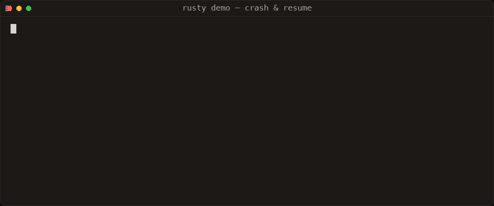
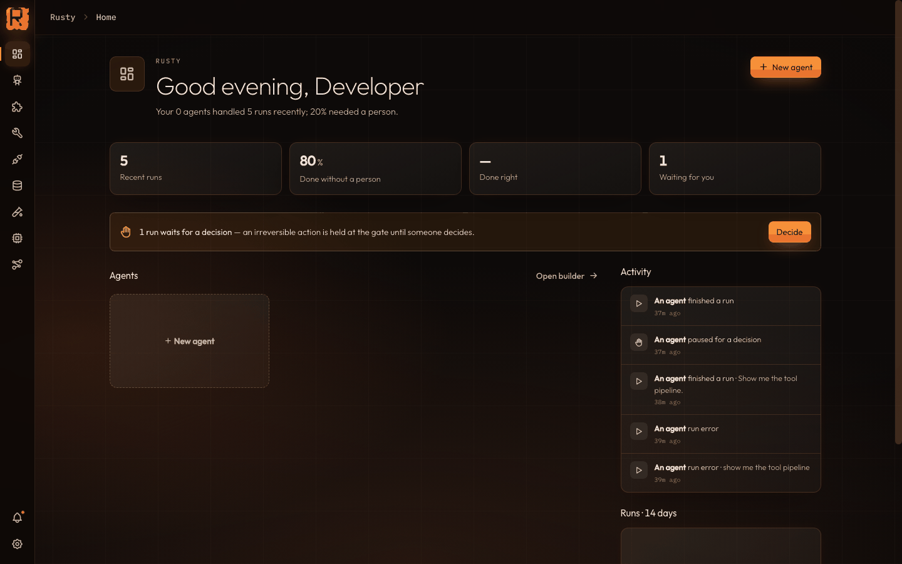
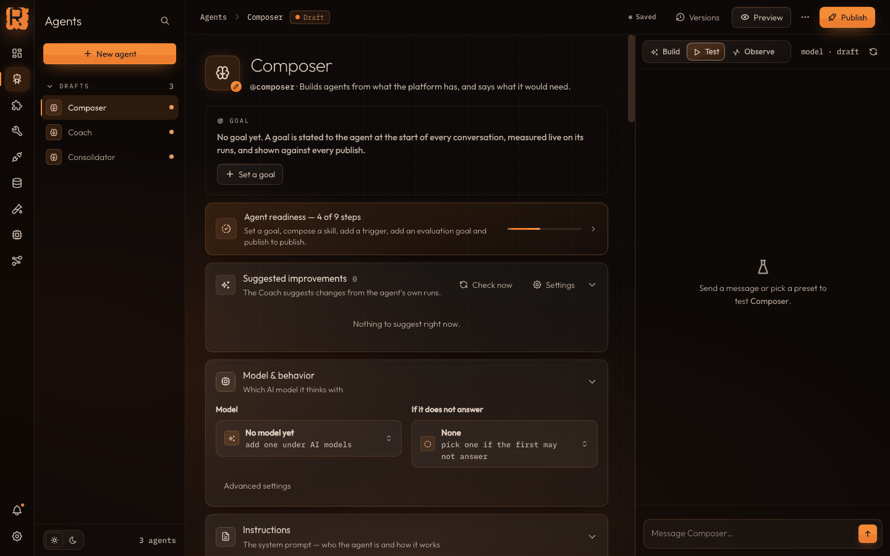
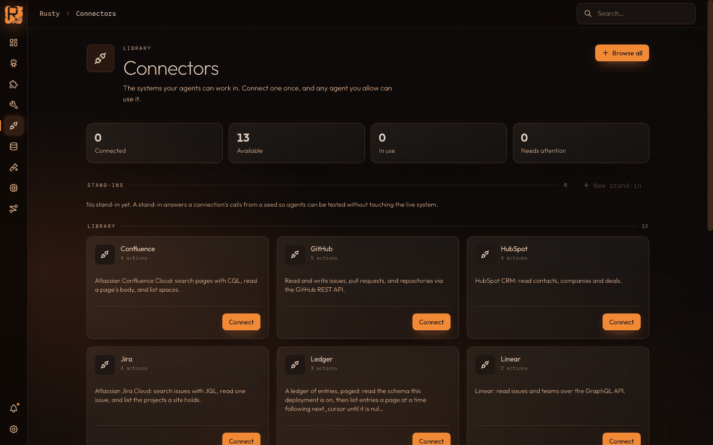
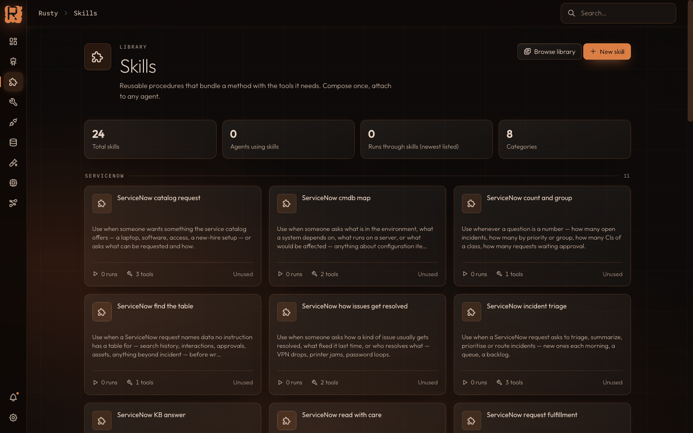
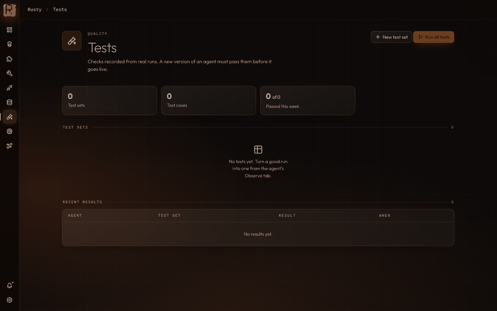
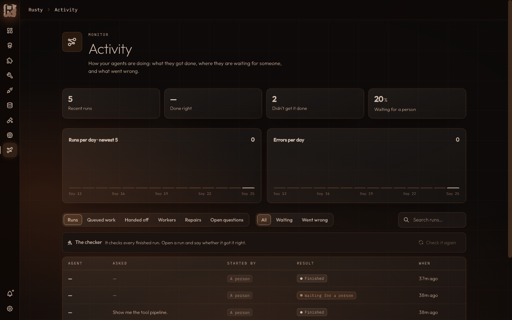

# Rusty

**The durable agent runtime built in Rust.**

[](https://github.com/dev-amjad-shaikh/rusty/actions/workflows/ci.yml)
[](LICENSE-MIT)
[](docs/architecture.md)

Rusty is a durable, LangGraph-style agent runtime and server built in Rust. You define an agent as a graph of nodes over schema-declared JSON state with runtime validation; the engine executes that graph in transactional super-steps and writes a versioned checkpoint at every step boundary. The same compiled graph runs embedded in your process, behind the included axum HTTP/SSE server as a single static binary, and across remote nodes and sandboxed WASM modules.

## Why Rusty exists

LangGraph proved the execution model: state channels with reducers, super-step parallelism, and checkpoints that turn durability, human-in-the-loop, and time travel into one primitive. Rusty rebuilds that model on tokio for teams who want it without operating a Python service.

Choose Rusty when:

- **Durability is a requirement, not a nicety.** Every super-step boundary is checkpointed — resume after a crash, suspend for human approval, fork and replay any historical step.
- **Deployment should be one binary.** Your graphs compile into your server: no Python runtime, no Redis, no orchestration config file. `Cargo.toml` is the new `langgraph.json`.
- **Your nodes aren't all in one place.** Remote nodes execute graph steps on remote services over HTTP (interrupts cross the wire), and `WasmNode` runs untrusted modules in a Wasmtime sandbox with fuel and memory caps.
- **Your clients aren't Rust.** The server is the interop layer: zero-dependency Python and TypeScript SDKs talk HTTP/SSE to it.

If you want a batteries-included Python ecosystem or a fully managed control plane today, LangGraph and LangGraph Platform are further along — see the honest comparison below.

## Status

Rusty is **v0.x** under active development. Packages version independently — see [docs/versioning.md](docs/versioning.md) for the scheme and [docs/stability.md](docs/stability.md) for what each package promises not to break. All seven packages are published: five crates on crates.io, the TypeScript client on npm, and the Python client on PyPI. History lives in [CHANGELOG.md](CHANGELOG.md); the plan lives in [docs/roadmap.md](docs/roadmap.md).

Latest release: **R0.12 — Operations Plane** (2026-08-11) — content-addressed run artifacts with lineage, previews, and retention, plus a deployment control plane: immutable revisions, dev/staging/prod environments, canary and shadow deployments wired to evaluation release gates, byte-exact rollback. Earlier cycles shipped the Flight Recorder, durable work, the Agent Fabric, governed learning, capsule isolation, and signed run receipts — see [CHANGELOG.md](CHANGELOG.md).

`main` carries one cycle past that release, not yet versioned: the **post-R0.12 product cycle** — schema-driven connectors, governed `SKILL.md` skills, the knowledge plane with cited retrieval, durable goals, the verifier trust suite, intelligence campaigns, and the Rusty Studio v4 workspace in the Rusty design language (the oxidised-canvas, ember-accent dark UI shown in the screenshots below). Crates stay at 0.12.x until the next versioned release; details in the [Unreleased section of the changelog](CHANGELOG.md).

## Install

```toml
[dependencies]
rusty-agent-runtime = "0.12"
tokio = { version = "1", features = ["full"] }
async-trait = "0.1"
serde_json = "1"
```

or `cargo add rusty-agent-runtime`. The server is `cargo add rusty-agent-server`. Optional crate features: `postgres` (Postgres checkpointer), `wasm` (sandboxed WASM nodes), and `genai` (multi-provider model access — OpenAI, Anthropic, Gemini, Ollama and more through one client; see [docs/provider-layer-design.md](docs/provider-layer-design.md)). MSRV is **Rust 1.86**, declared at the workspace root and checked in CI; the `genai` feature raises the floor for feature-enabled builds to 1.88 (genai's own requirement) — default builds are unaffected.

The clients install from npm and PyPI:

```bash
npm install @rusty-runtime/client   # TypeScript / JavaScript
pip install rusty-agent-runtime     # Python (imported as rusty_client)
```

### Try it in one command

```bash
git clone https://github.com/dev-amjad-shaikh/rusty.git && cd rusty
./scripts/dev.sh        # local: Rusty Server on :8100 + Rusty Studio on http://localhost:4400
# or
docker compose up       # the same pair, containerized
```

Open **http://localhost:4400** — the Agents front door. Every agent whose
behavior holds a conversation opens straight into chat, with the run's
journaled evidence live in the rail beside it. The first boot seeds an
administrator; its password lands in
`data/server-demo-checkpoints/bootstrap-admin.txt` (sign in with it, change
it, delete the file — the banner says the same). By default the demo's
`react_agent` answers from a deterministic local model (no network, no
credentials); to chat with a real model, put any OpenAI-compatible endpoint
in a git-ignored `.env.rusty-local` at the repo root:

```bash
RUSTY_LLM_BASE_URL=http://<host>:<port>/v1
RUSTY_LLM_MODEL=<model id>
RUSTY_LLM_API_KEY=<key>            # optional — a local vLLM/Ollama box needs none
# provider extensions, merged into every request (example: Qwen3 no-think)
RUSTY_LLM_EXTRA_BODY='{"chat_template_kwargs":{"enable_thinking":false},"max_tokens":2048}'
```

**Cold-start, measured** (Apple M2 Max, warm cargo/npm caches, 2026-09-26):
the clone is seconds, the workspace build ~1.5 min, the Studio build ~20 s,
then `dev.sh` boots the pair and Studio is chat-ready — about two minutes
end to end. A cold cargo cache adds the dependency compile on top;
`sccache` makes every rebuild after that near-instant. `Cargo.lock` is
deliberately not committed (library-first workspace), so the first build
resolves the dependency graph fresh — expect that step to vary with
registry freshness.

## Example

A ReAct agent over a scripted model — no network, deterministic output. The full version with tools and an event trace is [rusty-core/examples/react_agent.rs](rusty-core/examples/react_agent.rs).

```rust
use rusty_agent_runtime::prelude::*;
use serde_json::json;
use std::sync::Arc;
struct Echo; // scripted ChatModel: one canned reply (see examples/react_agent.rs for tools)
#[async_trait::async_trait]
impl ChatModel for Echo {
    async fn chat(&self, _: &[ChatMessage], _: &[serde_json::Value]) -> Result<ChatResponse> {
        Ok(ChatResponse { message: ChatMessage::assistant("42"), model: None, usage: None })
    }
}
#[tokio::main]
async fn main() -> Result<()> {
    let graph = create_react_agent(Arc::new(Echo), ToolRegistry::new())?;
    let spec = StateSpec::new().channel("messages", Reducer::AddMessages);
    let mut input = State::new();
    input.insert("messages", json!([ChatMessage::user("What is 17 + 25?")]));
    let outcome = Executor::new().run(&graph, &spec, input, RunConfig::new("demo")).await?;
    assert!(matches!(outcome, ExecutionOutcome::Done(_)));
    Ok(())
}
```

The graph topology is validated when you call `GraphBuilder::compile()` — `create_react_agent` does this internally — before any node or paid LLM call runs. Swap `Echo` for `OpenAiCompatibleClient` to talk to OpenAI, vLLM, Ollama, LM Studio, or a compatible gateway.

## Durability, demonstrated

No simulated failure — a real process, a real `kill -9`. A deep-dive run finishes two stages and parks mid-decision; the server is killed outright; a brand-new process boots against the same store, the completed work is intact, and the pending human decision resumes with one command:



The recording is the demo server (`cargo run --example server_demo -p rusty-agent-server`, stage delay shortened via `RUSTY_DEMO_STAGE_DELAY_MS`). The same flow runs unmodified at full stage length, and [`rusty-server/tests/crash_recovery.rs`](rusty-server/tests/crash_recovery.rs) asserts the SIGKILL-and-restart path in CI.

## Components

| Piece | Path | What it is |
|---|---|---|
| Rusty Core | [`rusty-core/`](rusty-core/) (`rusty-agent-runtime`) | The engine: state channels + reducers, graph builder, super-step executor, checkpoints (memory / JSON file / Postgres), interrupts, `Send` fan-out, prebuilt ReAct agent, MCP client, remote nodes, WASM nodes, Flight Recorder (run journal + exact replay). No HTTP. |
| Rusty Server | [`rusty-server/`](rusty-server/) | axum HTTP/SSE server: threads, background / blocking / streaming runs, checkpoint history, fork + replay, run journals + fixture download, assistants, crons, KV store, multi-tenant API-key auth. |
| Rusty Worker | [`rusty-worker/`](rusty-worker/) | Worker SDK: serves your node handlers over HTTP so `RemoteNode` can execute them remotely. |
| Rusty OTel | [`rusty-otel/`](rusty-otel/) | One-call `tracing` subscriber setup with optional OTLP span export. |
| Rusty Eval | [`rusty-eval/`](rusty-eval/) | Agent TestOps: versioned eval datasets, experiment reports, baseline-vs-candidate compare, statistical regression detection, model judge, failure clustering, release gates, human-feedback operations. |
| Rusty Studio | [`studio/`](studio/) | Zero-build debug UI: connect, run, stream, inspect state and checkpoint history, fork and replay, Flight Recorder timeline with causal path and branch compare — plus the v4 React workspace (agents, work board, connectors, skills, knowledge, operations). |
| Rusty SDKs | [`sdks/python/`](sdks/python/) · [`sdks/typescript/`](sdks/typescript/) | Zero-dependency `rusty_client` (Python) and `@rusty-runtime/client` (TypeScript) clients for the server API. |

Two support crates are not published: [`rusty-api/`](rusty-api/) — the dependency-light trait ABI extension crates compile against — and [`rusty-store/`](rusty-store/), the store abstraction behind the server backends.

## How Rusty compares

Factual as of 2026-09-26; `—` means "not present, or not verified by us".

| | Rusty | LangGraph (framework) | LangGraph Platform | Rust LLM frameworks (rig, langchain-rust) |
|---|---|---|---|---|
| Language | Rust (tokio) | Python (JS port available) | Hosts LangGraph agents | Rust |
| Execution model | Graph over schema-declared JSON state channels, Pregel/BSP super-steps | State graphs, Pregel-inspired super-steps | Same as the framework | Provider / tool / agent abstractions; no checkpointed graph runtime |
| Durability | Checkpoint at every super-step boundary; memory, JSON-file, or Postgres backends | Pluggable savers: memory, SQLite, Postgres | Managed persistence | — |
| Human-in-the-loop / time travel | Interrupt + resume; fork + replay from any checkpoint | Interrupts; checkpoint time travel | Yes | — |
| Deployment | Single static binary; library or server | Your Python application | Managed (from $35/mo) or enterprise self-host | Library only |
| Remote nodes / WASM sandbox | HTTP worker protocol, interrupts included / Wasmtime fuel + memory caps | — | — | — (rig's core library is WASM-compatible) |
| Server surface | Agent-Protocol subset: threads, runs, SSE, assistants, crons, KV, tenants | — (library only) | Full hosted platform | — |
| License | MIT OR Apache-2.0 | MIT | Commercial | MIT |
| Package registry | crates.io (five crates) · npm · PyPI | PyPI / npm | — | crates.io |

Sources: LangChain's checkpointing and time-travel documentation; third-party LangGraph pricing breakdown (2026-07); the rig project README.

## Production readiness — known limitations

Rusty is explicit about what v0.x is not:

- **Single-node executor.** One process runs the super-step loop. Remote nodes distribute node *work*, but the executor itself is not clustered and has no failover.
- **Durable queue.** Queued (pending) runs persist on enqueue and resume draining after a restart, on both store backends; in-flight runs were already checkpoint-covered. Autoscaling remains an open R1.0 item.
- **Persistence is single-node.** The core executor checkpoints only when you attach a `Checkpointer`; `InMemoryCheckpointer` is for dev/test and loses state on restart. On the server, checkpoints and the assistants / crons / KV store default to JSON files on local disk (`server_store: json_file` in `/info`) — Postgres requires the `postgres` feature, and there is no replication either way.
- **Idempotency contract.** Checkpoints happen at step boundaries, never mid-node: resume re-executes a node from its start, so node logic must be idempotent.
- **Open by default in dev — hardened in production.** With no API keys configured the dev server runs unauthenticated with permissive CORS (loudly warning if bound past loopback). A `production` server (`RUSTY_ENV=production`) refuses to boot without authentication and serves same-origin only unless `with_cors_allowed_origin` names a cross-origin browser client.
- **Deliberately rejected:** PyO3 / napi-rs bindings and a `cdylib` / C ABI — the HTTP/SSE server is the polyglot interop layer instead. Rationale in [docs/roadmap.md](docs/roadmap.md#explicitly-rejected).

## Screenshots

Rusty Studio in the Rusty design language — oxidised dark canvas, glass surfaces, one ember accent.

| | |
|---|---|
|  |  |
| Home — the front door: recent runs, the decision gate, and your agents. | Agents — the builder: goal, readiness, model & behavior, instructions, test beside the canvas. |
|  |  |
| Connectors — the systems your agents can work in; connect once, every allowed agent uses it. | Skills — reusable procedures that bundle a method with the tools it needs. |
|  |  |
| Tests — versioned datasets, experiments, and release gates. | Activity — what got done, where agents wait for a person, what went wrong. |

Step-by-step guides to everything above — building an agent, a skill, a tool, and adding a connector: [docs/how-to.md](docs/how-to.md).

## Documentation

- [docs/building-agentic-products.md](docs/building-agentic-products.md) — what Rusty is precisely, the five-concept mental model, and the product-building path from local graph to deployed binary.
- [docs/architecture.md](docs/architecture.md) — the anatomy deep-dive: how one run flows through the engine, eight diagrams, the named failure modes.
- [docs/how-to.md](docs/how-to.md) — build an agent, a skill, a tool, and add a connector, step by step, in Rusty Studio.
- [docs/server-quickstart.md](docs/server-quickstart.md) — zero to a served graph with interrupt/resume over HTTP in ten minutes.
- [docs/studio.md](docs/studio.md) — the Studio workspace, its views, and the screens above.
- [docs/roadmap.md](docs/roadmap.md) — phases, what's implemented, what's explicitly rejected.
- [docs/versioning.md](docs/versioning.md) — independent per-package versioning and which version governs which compatibility boundary.
- [docs/stability.md](docs/stability.md) — stability guarantees and deprecation policy per package.
- [rusty-core/examples/](rusty-core/examples/) — `react_agent`, `parallel_fanout`, `human_in_loop`, `live_agent`.

## Contributing & license

Contributions welcome — see [CONTRIBUTING.md](CONTRIBUTING.md) (workspace-wide) and [rusty-core/CONTRIBUTING.md](rusty-core/CONTRIBUTING.md) (Rusty Core crate). Dual-licensed under [MIT](LICENSE-MIT) OR [Apache-2.0](LICENSE-APACHE), at your option.
