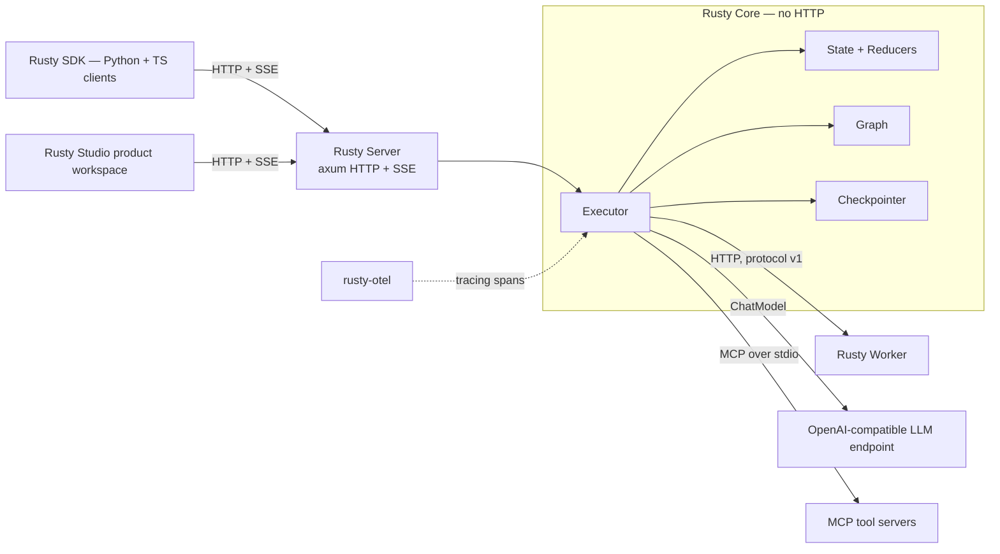
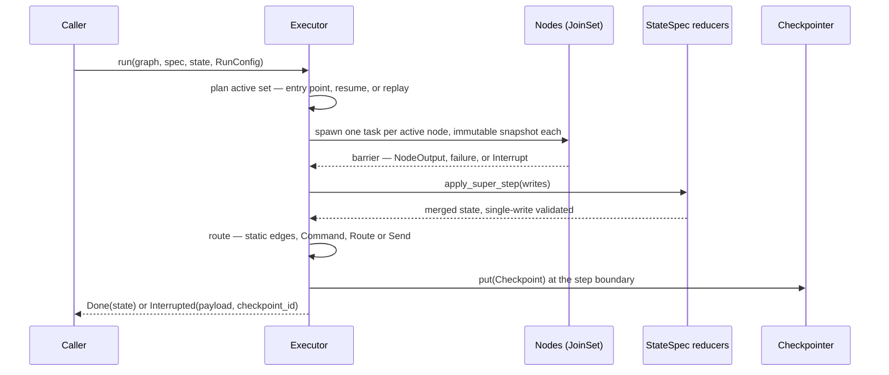
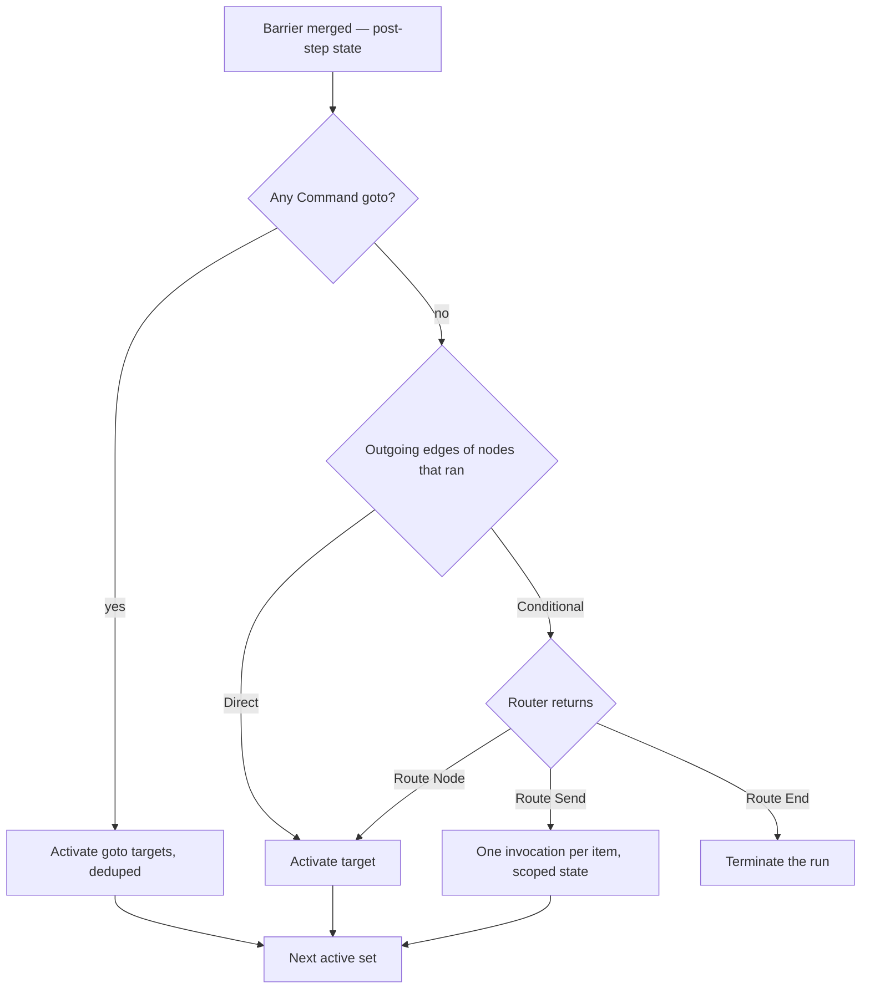
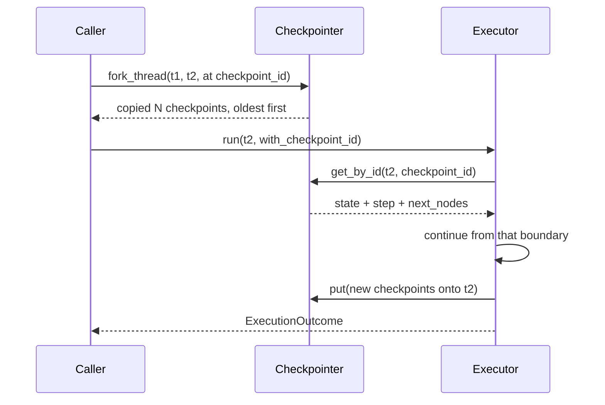
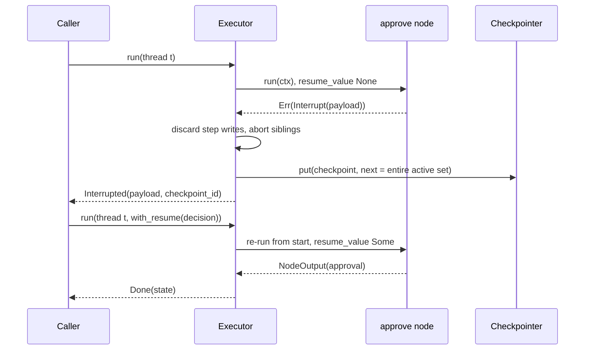
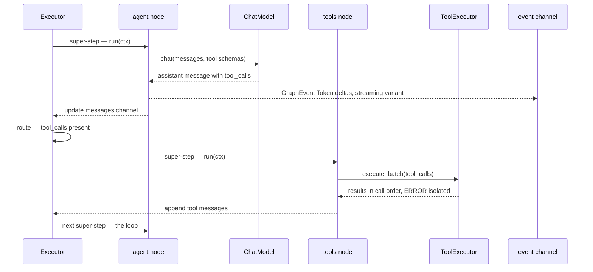
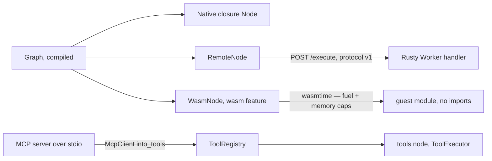
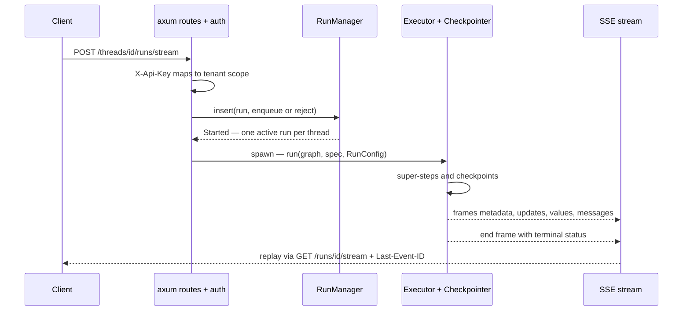

# Rusty architecture — the anatomy of the platform

> This is the deep-dive companion to the [project README](../README.md). The README is the landing page: what Rusty is, how to install it, and the shortest path to a running agent. This document is the anatomy: what the pieces are, how one run flows through them, and why each mechanism exists — walked through with the real code.


**The durable agent runtime built in Rust.**

**Rusty is a full-Rust agentic platform**: a LangGraph-style execution core (Rusty Core), an axum HTTP/SSE server (Rusty Server) that serves compiled graphs from a single static binary, a worker SDK for remote nodes (Rusty Worker), an OpenTelemetry export crate, zero-dependency Python and TypeScript client SDKs (Rusty SDK), and a typed, self-hostable product workspace (Rusty Studio). Dual-licensed under MIT OR Apache-2.0. Public repo: [github.com/dev-amjad-shaikh/rusty](https://github.com/dev-amjad-shaikh/rusty).

```bash
git clone https://github.com/dev-amjad-shaikh/rusty.git
cd rusty/rusty-server
cargo run --example server_demo   # serves a scripted ReAct agent on http://127.0.0.1:8100
# in another terminal: python3 studio/serve.py, then open http://127.0.0.1:8000/
```

---

## 1. Orientation — the platform map

Everything in the repo hangs off one crate. Rusty Core (the `rusty-agent-runtime` crate, in `rusty-core/`) has no HTTP and no server dependencies; every other crate is a shell around it or a client of those shells.



| Crate | Version | Role in the anatomy |
|---|---|---|
| [`rusty-agent-runtime`](../rusty-core/) | 0.4.0 | The engine: state channels + reducers, graph builder with validation when you call `GraphBuilder::compile()`, the Pregel/BSP super-step executor, versioned checkpoints (memory / JSON-file / Postgres), interrupts & resume, `Send` fan-out, `ChatModel` + parallel tool execution, the prebuilt ReAct agent, MCP client, remote nodes, sandboxed `WasmNode` (feature `wasm`). |
| [`rusty-agent-server`](../rusty-server/) | 0.4.0 | The network face: an axum library crate implementing an Agent-Protocol subset — threads, background/blocking/SSE runs, checkpoint history, fork + replay time travel, assistants, crons, KV store, API-key auth with multi-tenancy. You call `rusty_agent_server::serve(registry, config)` from your own `main.rs` and deploy the result as one static binary. |
| [`rusty-worker`](../rusty-worker/) | 0.1.0 | The worker SDK: serves your node handlers over HTTP so the core's `RemoteNode` can execute graph nodes on remote services. HITL interrupts cross the wire. |
| [`rusty-otel`](../rusty-otel/) | 0.1.0 | One-call `tracing` subscriber setup for Rusty Core executors, with optional OTLP span export (OpenTelemetry 0.32, HTTP/protobuf). |

Around the crates: the Rusty SDK — [`sdks/python/`](../sdks/python/) (PyPI `rusty-agent-runtime`, imported as `rusty_client`) and [`sdks/typescript/`](../sdks/typescript/) (npm `@rusty-runtime/client`), zero-dependency clients, each verified by an e2e suite that boots the real server binary — and [`studio/`](../studio/) (Rusty Studio: a React/TypeScript product workspace for Agents, Work, and Operations, shipped as committed static assets; its former single-file console remains at `/advanced/legacy` during migration). The server is the polyglot interop layer by design: native bindings (PyO3, napi-rs, C ABI) were considered and rejected — see [docs/roadmap.md](roadmap.md#explicitly-rejected).

## 2. The mental model — an agent is a graph over shared state, executed in super-steps

Strip the platform down and four primitives remain. Each exists to kill a specific failure class of agent systems.

**Primitive 1: typed state channels with reducers** — where “typed state” means schema-declared JSON state with runtime validation, not Rust-level typing. Nodes never call each other and never return whole state. Every state key is a *channel* whose [`Reducer`](../rusty-core/src/state.rs:L128) defines how partial updates merge: `Overwrite` (LangGraph's `LastValue`), `Append`, `DeepMerge`, `AddMessages` (ID-aware message upsert). The `StateSpec` is the complete schema — a write to an undeclared channel is an error, and a second write to a single-write channel within one super-step is an error. That single-write rule eliminates an entire bug class: in a parallel graph, two nodes silently clobbering the same key is otherwise the default outcome, and it surfaces only as a corrupted conversation three steps later. Here it is an `InvalidUpdate` error at the barrier, naming both writers.

**Primitive 2: nodes.** A node is an async function — any `Fn(NodeContext) -> impl Future<Output = Result<NodeOutput>>` implements the [`Node` trait](../rusty-core/src/node.rs:L276) via a blanket impl — that receives an *immutable snapshot* of the state as of the super-step start and returns a *partial* update plus an optional routing [`Command`](../rusty-core/src/node.rs:L211). Because the snapshot is cloned per invocation, snapshot isolation is structural, not conventional: two nodes in the same super-step physically cannot observe each other's writes.

**Primitive 3: the super-step loop.** Execution proceeds in discrete super-steps (Google Pregel / bulk-synchronous-parallel): *plan → run the active set in parallel → barrier → merge → route → checkpoint*. The barrier is what makes shared-state parallelism safe, and it makes each step transactional: if any node fails or interrupts, the step's writes are discarded wholesale. A graph cycle — the ReAct loop `agent → tools → agent` — is not call-stack recursion; it is nodes being re-scheduled across super-steps, which is why the runaway-loop guard is a step budget (`max_steps`, default 1000), not a stack limit.

**Primitive 4: versioned checkpoints.** At every super-step boundary the executor persists a [`Checkpoint`](../rusty-core/src/checkpoint.rs:L27): step index, full channel state, and the next-node set. One primitive yields four features that are usually four subsystems: durable execution (resume after a crash), human-in-the-loop (suspend, serialize, approve, resume), time travel (load any historical checkpoint, fork alternate timelines), and partial-failure recovery. Checkpoints happen at boundaries, never mid-node — so resume re-executes a node from its start, and node logic must be idempotent. That idempotency contract is the price of durability, and the engine states it plainly rather than hiding it.

## 3. One run, end to end

A call to [`Executor::run`](../rusty-core/src/executor.rs:L366) restores-or-seeds state, then loops [`execute_super_step`](../rusty-core/src/executor.rs:L527) until routing yields an empty next set (`Done`), a node interrupts (`Interrupted`), or `max_steps` trips (error).



The rest of this document walks each stage with the real code.

## 4. Stage by stage

### 4a. State and channels — the merge is validated before it happens

[`StateSpec::apply_super_step`](../rusty-core/src/state.rs:L387) receives every write of one super-step as `(node_name, updates)` pairs. Two properties matter. First, validation is all-or-nothing: every channel is checked — declared, correctly typed for its reducer, within the single-write budget — *before* a single mutation is applied, so a failed step leaves state untouched. Second, fan-in is deterministic: writes arrive from concurrently completing tasks in nondeterministic order, so they are sorted by node name (`collected.sort_by(|a, b| a.0.cmp(&b.0))`, rusty-core/src/state.rs:L400) before merging. Checkpoints derived from the merge are then stable run-to-run.

The single-write rule, verbatim (rusty-core/src/state.rs:L432):

```rust
if *count > 1 && !reducer.allows_multiple_writes() {
    return Err(RustyError::InvalidUpdate(format!(
        "channel `{channel}` can receive only one value per super-step \
         (reducer: {reducer}); already written by node `{}`, second write from \
         node `{node}`. Use a multi-write reducer (Append/DeepMerge/\
         AddMessages) to handle concurrent writes.",
        first_writer[channel.as_str()],
    )));
}
```

The error message tells you the fix: if you intended fan-in, declare the channel with a multi-write reducer. `AddMessages` deserves a note of its own — it is LangGraph's `add_messages`, an ID-aware upsert over a message array, so a node can correct a message it wrote earlier (by `"id"`) while parallel tool results append alongside it (rusty-core/src/state.rs:L260).

### 4b. Graph building — invalid topologies fail at `compile()`, not mid-run

[`GraphBuilder`](../rusty-core/src/graph.rs:L210) is deliberately thin: register nodes under names, add static edges (`from → to`, all destinations of multiple edges activate in parallel), add at most one conditional edge per source (an async router reading the post-barrier state), set the entry point. [`compile()`](../rusty-core/src/graph.rs:L305) freezes the graph into an immutable, `Arc`-shared `Graph` and rejects, before any node or paid LLM call runs: an empty graph, a missing or dangling entry point, edges referencing unknown nodes, reserved node names (`__end__` and anything `__`-prefixed), duplicate static edges (which would surface later as a spurious double-write failure), multiple conditional edges from one node, and mixed routing (rusty-core/src/graph.rs:L367):

```rust
if let Some(from) = direct_sources.intersection(&conditional_sources).next() {
    return Err(RustyError::Graph(format!(
        "node `{from}` has both static and conditional edges; routing would \
         be ambiguous — use one kind per source node"
    )));
}
```

Conditional router targets and `Send` node names are validated at execution time instead — they are data-dependent by design.

### 4c. The super-step loop — plan, spawn, barrier, merge, route, checkpoint

The loop body is [`execute_super_step`](../rusty-core/src/executor.rs:L527). Compute is a `tokio::task::JoinSet`: each active node gets its own clone of the start-of-step snapshot (a `Send` fan-out overlays its scoped item onto that private copy first), and is spawned with its own tracing span (rusty-core/src/executor.rs:L595):

```rust
let node_span = tracing::info_span!("rusty.node", node = %name, step = step);
join_set.spawn(async move { (name, node.run(ctx).await) }.instrument(node_span));
```

The barrier (rusty-core/src/executor.rs:L609) drains the JoinSet. Three outcomes per node: success (updates and any `Command` are collected), failure (the JoinSet is dropped, aborting stragglers, and the whole step's writes are discarded — the step is transactional), or interrupt (the run suspends; see 4f). Only after the barrier does the merge of 4a run, then routing of 4d, then the boundary checkpoint of 4e. Node failures are classified for observability: LLM and tool errors are the transient, retryable classes; everything else is a hard failure (rusty-core/src/executor.rs:L641). The guard against runaway cycles is checked before each step: after `max_steps` super-steps without termination the run aborts with a `Graph` error naming the likely cause — an infinite cycle or a missing terminating route (rusty-core/src/executor.rs:L472).

### 4d. Routing — three kinds of "what runs next"

Routing consumes the post-barrier state. The decision tree:



The conditional router's vocabulary is three values (rusty-core/src/graph.rs:L49):

```rust
pub enum Route {
    /// Activate exactly one node next.
    Node(String),
    /// Dynamic fan-out (LangGraph `Send` API): activate one node invocation
    /// per item, each with its own scoped input state. The canonical
    /// map-reduce pattern: items are generated at runtime, each mapped
    /// through a node, results fan back in through multi-write reducers.
    Send(Vec<Send>),
    /// Terminate the run.
    End,
}
```

`Route::Send` is the map-reduce primitive: items are generated at runtime, each is mapped through one invocation of a node with that item overlaid as scoped state, and results fan back in through multi-write reducers. A node's own [`Command::goto`](../rusty-core/src/node.rs:L228) output overrides the static edge set entirely; unknown targets — from routers, `Send`s, or commands — are executor errors naming the offending node. An empty next set ends the run.

### 4e. Durable execution — one checkpoint primitive, four features

The [`Checkpointer` trait](../rusty-core/src/checkpoint.rs:L74) is five methods: `put`, `get_latest`, `list`, `get_by_id`, `fork_thread`. Three savers are implemented: `InMemoryCheckpointer` (dev/test), `JsonFileCheckpointer` (one JSON file per checkpoint under `{dir}/{thread_id}/`, atomic temp-file-then-rename writes, a `latest` pointer file, per-thread put serialization; rusty-core/src/checkpoint.rs:L262), and `PostgresCheckpointer` (feature `postgres`). The executor writes one checkpoint per super-step boundary (rusty-core/src/executor.rs:L809):

```rust
if let Some(checkpointer) = &self.checkpointer {
    let next_names: Vec<String> = next.iter().map(|t| t.name.clone()).collect();
    let checkpoint =
        Checkpoint::new(config.thread_id.clone(), step, state.clone(), next_names);
    let checkpoint_id = checkpoint.id.clone();
    checkpointer.put(checkpoint).await?;
```

Time travel is two operations. `fork_thread(src, dst, at_checkpoint_id)` copies a thread's history — oldest first, full or truncated at a checkpoint — into a new thread id (rusty-core/src/checkpoint.rs:L133). `RunConfig::with_checkpoint_id(id)` then starts a run from that checkpoint's state and next-node set instead of the latest (rusty-core/src/executor.rs:L194). The safe pattern is fork first, replay on the fork: replaying on the original thread appends new history on top of the old timeline, which is legal — `get_latest` defines recency by insertion order, not step number, precisely so a later resume continues the newest timeline (rusty-core/src/checkpoint.rs:L90) — but usually not what you want.



### 4f. Human-in-the-loop — an interrupt is a transaction abort with a receipt

A node suspends the run by returning `Err(ctx.interrupt(payload))` ([`NodeContext::interrupt`](../rusty-core/src/node.rs:L134)). The mechanism is the transactional step of 4c with one addition: the suspension is run-wide, so the in-flight step's writes are discarded — including writes from sibling nodes that already completed — still-running siblings are aborted, and the suspension checkpoint re-schedules the *entire active set* of the step, not just the interrupting node. Anything less would silently lose the siblings' discarded work (rusty-core/src/executor.rs:L656, abridged):

```rust
if let Some((name, value)) = interrupted {
    // … the suspension checkpoint re-schedules the ENTIRE active set …
    drop(join_set);
    // …
    let pending: Vec<String> = active.iter().map(|t| t.name.clone()).collect();
    let checkpoint =
        Checkpoint::new(config.thread_id.clone(), step, state.clone(), pending);
```

The caller receives `ExecutionOutcome::Interrupted { value, state, checkpoint_id }`. To resume: same `thread_id`, [`RunConfig::with_resume(value)`](../rusty-core/src/executor.rs:L186). Every node of the suspended set re-executes from its start; the resume value is broadcast to all of them for the first super-step, so a resumable node checks [`ctx.resume_value()`](../rusty-core/src/node.rs:L118) first and must be idempotent in everything it did before interrupting.



### 4g. LLM and tools — the model is one node, the loop is the graph

The LLM layer is a deliberately minimal trait, [`ChatModel`](../rusty-core/src/llm.rs:L310): `chat(messages, tool_schemas)` in, one assistant `ChatMessage` (text and/or `tool_calls`) out, with `chat_stream` adding a token-delta callback. One client is implemented, `OpenAiCompatibleClient`, which works against OpenAI, vLLM, Ollama, LM Studio and compatible gateways, and classifies failures by convention: connect errors, timeouts, HTTP 5xx, 408 and 429 are retryable with capped, jittered exponential backoff (`Retry-After` floors the delay); other 4xx are permanent (rusty-core/src/llm.rs:L522). Tools are the mirror image: a [`Tool` trait](../rusty-core/src/tool.rs:L26), a `ToolRegistry` that emits OpenAI-format schemas, and a [`ToolExecutor::execute_batch`](../rusty-core/src/tool.rs:L150) that dispatches a batch of tool calls concurrently, preserves call order, and isolates failures — a failing or even panicking tool becomes an `ERROR:` tool message the model can read and recover from, never a batch abort (rusty-core/src/tool.rs:L167):

```rust
match result {
    Ok(Ok(content)) => ChatMessage::tool_result(&call.id, content),
    Ok(Err(e)) => ChatMessage::tool_result(&call.id, format!("ERROR: {e}")),
```

[`create_react_agent`](../rusty-core/src/react.rs:L81) assembles the classic loop as a two-node cyclic graph over a single `messages` channel with the `AddMessages` reducer: an `agent` node that calls the model and appends the assistant message, a `tools` node that dispatches pending tool calls, a conditional edge `agent → tools | End`, and a static edge `tools → agent`. The cycle is super-steps, not recursion — each hop is a full plan/barrier/merge/route/checkpoint pass, so a ReAct agent gets durability and HITL for free. The streaming variant ([`create_react_agent_streaming`](../rusty-core/src/react.rs:L99)) forwards token deltas into the run's event channel as `GraphEvent::Token` — the LangGraph `messages` stream mode (rusty-core/src/react.rs:L132):

```rust
model
    .chat_stream(&messages, &tool_schemas, &mut |chunk| {
        if !chunk.delta.is_empty() {
            let _ = tx.try_send(GraphEvent::Token {
                node: AGENT_NODE.to_owned(),
                delta: chunk.delta,
            });
        }
    })
    .await?
```



### 4h. Three ways code enters a graph

The `Node` trait is the only seam. Behind it, the engine runs three kinds of code without being able to tell them apart.



**Native nodes** are async closures, covered above. **Remote nodes** ([`RemoteNode`](../rusty-core/src/remote.rs)) serialize the invocation — protocol version, node name, the same immutable super-step snapshot, and the `NodeConfig` — and POST it to a worker's `/execute` endpoint. The reply carries exactly one of `output`, `error`, or `interrupt`; an interrupt surfaces locally as `RustyError::Interrupt`, so a remote node suspends and resumes the run exactly like a local one. Retries are deliberately narrow: only transport-class failures (connect, timeout, 5xx/408/429) are retried, never worker-reported errors — the worker already made a definitive decision (rusty-core/src/remote.rs:L34). The `rusty-worker` crate is the SDK that serves the other end.

**WASM nodes** ([`WasmNode`](../rusty-core/src/wasm_node.rs), feature `wasm`) run untrusted or community modules via Wasmtime behind a JSON-in/JSON-out ABI. The sandbox is three walls: fuel metering aborts infinite loops with a trap, a `ResourceLimiter` caps memory growth, and the guest instantiates with an empty `Linker` — no WASI, no host functions, no ambient authority (rusty-core/src/wasm_node.rs:L69):

```rust
impl Default for SandboxLimits {
    fn default() -> Self {
        Self {
            fuel: 10_000_000,
            max_memory_bytes: 16 * 1024 * 1024, // 16 MiB
        }
    }
}
```

**MCP tools** are not nodes at all: the [`mcp` module](../rusty-core/src/mcp.rs) is a JSON-RPC client over stdio (newline-delimited or `Content-Length` framing, per-request timeouts, a 16 MiB frame cap against hostile length prefixes — rusty-core/src/mcp.rs:L71) whose `McpClient::into_tools()` lists a server's tools and returns them as `Arc<dyn Tool>` for direct registration in a `ToolRegistry`. MCP tools therefore flow through the same `ToolExecutor` and the same ReAct graph with zero graph changes.

## 5. The server around the engine

`rusty-agent-server` adds nothing to the execution semantics; it exposes them. A run request authenticates, schedules against a per-thread slot, and drives the same `Executor` over the same checkpointer, translating `GraphEvent`s into SSE frames as it goes.



The resource model, each row backed by the same primitives:

| Resource | What it is |
|---|---|
| **Threads** | A session bound to a registered graph; namespaces all checkpoints. `GET /threads/{id}/state`, `POST .../history`, `POST .../fork` expose the checkpoint log directly. |
| **Runs** | One execution of the thread's graph. Three submission modes: background (`202 + run_id`), blocking (`runs/wait`), streaming (`runs/stream`). `GET /runs/{id}` polls status and terminal output. |
| **Assistants** | Named graph aliases with config metadata; a run can reference `assistant_id` and inherit its `recursion_limit`. |
| **Crons** | Recurring runs of a graph on an interval or 5-field cron expression. |
| **KV store** | A namespaced JSON document store (`PUT/GET/DELETE /store/{ns}/{key}`) for application state that is not graph state. |

Concurrency is one rule: at most one *active* run per thread ([`RunManager`](../rusty-server/src/runs.rs:L338)). A second submission on a busy thread is either rejected with 409 (`multitask_strategy: "reject"`) or appended to a per-thread FIFO that drains as runs finish (the default `enqueue`, depth-capped by `ServerConfig::max_concurrent_runs_per_thread`). SSE frames carry ids of the form `{checkpoint_id}:{step}:{seq}`; the attach endpoint `GET /runs/{id}/stream` honors `Last-Event-ID` by replaying the run's bounded event log from that sequence and then following the live broadcast (rusty-server/src/sse.rs:L38). The run-create endpoint deliberately ignores the header — a fresh run starts a fresh frame sequence.

**Multi-tenancy** is namespacing, not filtering. `ServerConfig::with_tenant_key(tenant, key)` maps `X-Api-Key` values to tenants; internally every tenant's threads, runs, assistants, crons, and KV entries live under a `{tenant}/` id prefix, so another tenant's resource simply does not exist in your namespace — cross-tenant access answers 404, never 403, to avoid leaking existence (rusty-server/src/routes.rs:L144). With no keys configured the server runs in open dev mode, byte-identical behavior, everything in the `default` tenant. With the `postgres` feature, `ServerConfig::with_postgres(url)` moves both the run checkpoints and the whole platform surface into auto-migrated Postgres tables.

**Durable work (R0.6, landing in waves).** The server's Postgres-backed task queue — leases with heartbeats and visibility timeouts, a closed retry taxonomy (`ErrorClass` → `RetryDecision`: full-jitter exponential backoff capped at 5 minutes, attempt limits, a dead-letter queue), idempotency keys, and cancellation propagation (wave 2a: `POST /tasks/{id}/cancel` and `POST /runs/{id}/cancel`, heartbeat-carried `cancel_requested` hints, whole-task deadline enforcement) — turns `rusty-worker` services from remote-execution helpers into durable activities. Wave 2b added the transactional outbox (`POST /tasks/outbox` and `update_state`'s `enqueue` list, one transaction with the checkpoint on Postgres, a polling relay that publishes pending rows deduped on the task's idempotency key) and effect receipts (reported on task completion, stored on the record, journaled into the run as an `effect_receipt` event). Wave 2c added drain and graceful shutdown: workers drain via the `ActivityWorker` shutdown token (claiming stops, in-flight attempts settle within a 25 s grace or are aborted and released to lease expiry — never settled `cancelled`, which would kill the task), and `serve` drains on SIGINT/SIGTERM (axum graceful shutdown; in-flight runs cooperatively cancelled at super-step boundaries through core's `RunConfig::cancellation` hook, ending terminal-`cancelled` and resumable from their last checkpoint; relay and cron scheduler stopped; new runs 503; the whole drain bounded by `ServerConfig::shutdown_grace`). Wave 3a added the queue-side scaling controls: named pools with per-pool concurrency limits (the claim path counts unexpired leases and skips saturated pools — a guardrail, not an invariant), tenant quotas (`429 quota_exceeded` at submission on all three submission surfaces, pending outbox rows counting against the backlog), exact-string worker-version pinning (a pinned task is claimable only by a worker advertising that exact `worker_version`, across retries), and autoscaling signals as `GET /tasks/metrics` (per-pool queue depth, oldest-visible-task age, live leases, configured limit, lease saturation). Still ahead: run-side outbox/receipt/version wiring into the executor, and published under-load numbers for the signals. The shared contracts freeze in [`rusty-core/src/durable.rs`](../rusty-core/src/durable.rs) (`TaskEnvelope`, `ErrorClass`, `classify_retry`); the design — effectively-once semantics, honest about not being exactly-once — is in [docs/durable-work-design.md](durable-work-design.md). The composition with the Flight Recorder is the point: a task's declared `Effect` is what makes its retry safe, and the task lifecycle is journaled as evidence.

## 6. Observability

The executor emits `tracing` telemetry; the library installs no subscriber — the application chooses one. The span taxonomy mirrors the loop (rusty-core/src/executor.rs:L30):

- `rusty.run` (INFO) — one per `Executor::run` call; fields `thread_id`, `max_steps`, `resume`, `replay`. Parent of everything below.
- `rusty.super_step` (DEBUG) — one per super-step; fields `step`, `active_nodes`.
- `rusty.node` (INFO) — one per spawned node task; fields `node`, `step`.
- Events: DEBUG on each barrier merge (channels written), INFO on interrupt and run completion (`steps`, `duration_ms`), WARN on node failure with a `retryable` classification.

The `rusty-otel` crate turns this on in one call — a `tracing` subscriber with optional OTLP span export — so a run shows up in your collector as a run span with super-step and node children, no instrumentation code of your own.

## 7. The whole thing, in one page of code

Everything above — a reducer, a conditional edge, an interrupt, a checkpointed resume — in one runnable program (assemble from `rusty-core/examples/human_in_loop.rs` and `rusty-core/README.md`; every identifier is in the prelude):

```rust
use rusty_agent_runtime::prelude::*;
use serde_json::{json, Value};
use std::sync::Arc;

#[tokio::main]
async fn main() -> Result<()> {
    // 1. State schema: three channels, one writer each — LastValue semantics.
    let spec = StateSpec::new()
        .channel("draft", Reducer::Overwrite)
        .channel("approval", Reducer::Overwrite)
        .channel("published", Reducer::Overwrite);

    // 2. Nodes: async closures implement Node via a blanket impl.
    let mut builder = GraphBuilder::new();
    builder.add_node("draft", |_ctx: NodeContext| async move {
        Ok(NodeOutput::update("draft", json!("Ship the anatomy README")))
    });
    // The resumable node: check resume_value() FIRST; interrupt only when
    // no human decision exists yet. On resume it re-runs from the top.
    builder.add_node("approve", |ctx: NodeContext| async move {
        match ctx.resume_value() {
            Some(decision) => Ok(NodeOutput::update("approval", decision.clone())),
            None => Err(ctx.interrupt(json!({"prompt": "Approve this draft?"}))),
        }
    });
    builder.add_node("publish", |ctx: NodeContext| async move {
        let draft = ctx.state().get("draft").cloned().unwrap_or(Value::Null);
        Ok(NodeOutput::update("published", json!({"draft": draft})))
    });

    // 3. Edges: draft -> approve statically; approve routes on post-barrier state.
    builder.set_entry_point("draft");
    builder.add_edge("draft", "approve");
    builder.add_conditional_edges("approve", |state| async move {
        let approved = state
            .get("approval")
            .and_then(|a| a.get("approved"))
            .and_then(Value::as_bool)
            .unwrap_or(false);
        Ok(if approved { Route::Node("publish".into()) } else { Route::End })
    });
    let graph = builder.compile()?;   // topology validated here, before any node runs

    // 4. Executor with checkpoints: one per super-step boundary.
    let executor = Executor::with_checkpointer(Arc::new(InMemoryCheckpointer::new()));
    let thread = "anatomy-demo";      // the thread id is the resume handle

    // Phase 1: runs draft, then approve interrupts — the step is discarded,
    // a suspension checkpoint re-scheduling `approve` is persisted.
    let outcome = executor
        .run(&graph, &spec, State::new(), RunConfig::new(thread))
        .await?;
    assert!(outcome.is_interrupted());

    // Phase 2: same thread id + a resume value. The checkpointed state takes
    // precedence over the State::new() argument; approve re-executes with
    // resume_value() == Some(decision), routes to publish, and terminates.
    let decision = json!({"approved": true, "reviewer": "alice"});
    let outcome = executor
        .run(&graph, &spec, State::new(), RunConfig::new(thread).with_resume(decision))
        .await?;
    match outcome {
        ExecutionOutcome::Done(state) => println!("{}", state.to_value()),
        ExecutionOutcome::Interrupted { .. } => unreachable!("already approved"),
    }
    Ok(())
}
```

Runnable variants of each piece live in [`rusty-core/examples/`](../rusty-core/examples/): `react_agent`, `parallel_fanout`, `human_in_loop`, `live_agent`.

## 8. Named failure modes

Agent systems fail in a small number of characteristic ways. Each row names one, and what the mechanism above does about it.

| Failure mode | Rusty's response |
|---|---|
| **A node fails mid-step** | The super-step is transactional: the JoinSet is dropped, stragglers abort, every write of the step is discarded, and the run errors naming the node and step (rusty-core/src/executor.rs:L638). No half-applied state. |
| **Two parallel nodes write the same `LastValue` channel** | `InvalidUpdate` at the barrier, before any mutation, naming both writers and prescribing a multi-write reducer (rusty-core/src/state.rs:L432). |
| **LLM endpoint returns 429 / 5xx / times out** | Classified retryable; capped, jittered exponential backoff with `Retry-After` as a floor. Other 4xx are permanent and surface immediately (rusty-core/src/llm.rs:L522). Node-level, LLM and tool errors are the retryable classes in executor telemetry (rusty-core/src/executor.rs:L641). |
| **A tool throws or panics** | Contained per call: the batch returns an `ERROR:` tool message in that call's slot, in order, and the model sees the failure as data (rusty-core/src/tool.rs:L150). |
| **A second run arrives on a busy thread** | One active run per thread, enforced by the `RunManager`: `reject` answers 409; `enqueue` (default) queues FIFO up to the configured depth, then 409 (rusty-server/src/runs.rs:L350). |
| **Replay leaves a stale "latest" head** | Recency is insertion order, not step number: replay appends a new timeline and resume follows it; deterministic `(step, created_at, id)` listing keeps fork truncation stable across backends (rusty-core/src/checkpoint.rs:L90). The safe pattern is fork first, replay on the fork. |
| **A runaway graph cycle** | A cycle is re-scheduling, not recursion, so the guard is a step budget: `max_steps` (default 1000) aborts with an error naming the likely infinite cycle (rusty-core/src/executor.rs:L472). |
| **A guest WASM module loops forever or eats memory** | Fuel metering traps the loop; a `ResourceLimiter` rejects memory growth past the cap; the guest has no imports at all — no WASI, no host functions (rusty-core/src/wasm_node.rs:L31). |
| **A hostile MCP server declares a giant frame** | Inbound frames are capped at 16 MiB *before* any length-driven allocation; per-request timeouts bound waiting (rusty-core/src/mcp.rs:L71). |
| **A client probes another tenant's thread** | Tenant isolation is id namespacing: the foreign thread does not exist in your scope, so the answer is 404 (never 403 — existence is not leaked); malformed client ids are rejected 400 (rusty-server/src/routes.rs:L144). |

## 9. Where the project is today

Platform releases group the monorepo's independently-versioned crates; [CHANGELOG.md](../CHANGELOG.md) carries the history and [docs/roadmap.md](roadmap.md) the per-phase detail.

## Releases

Release branding maps onto the platform versions as follows. R0.1–R0.4 are implemented in this repo; R1.0 — Unleashed is the upcoming 1.0 track.

| Release | Name | Maps to | Status |
|---|---|---|---|
| R0.1 | Ignition | v0.1 — the core kernel: channels, executor, checkpoints, HITL, `Send`, ReAct (`rusty-agent-runtime` 0.1.0) | Implemented 2026-07-31 |
| R0.2 | Persistence | v0.2 — Postgres checkpointer, token streaming, Rusty Server Phase A (`rusty-agent-runtime` 0.2.0, `rusty-agent-server` 0.1.0) | Implemented 2026-08-05 |
| R0.3 | Interop | v0.3 — MCP client, remote nodes + `rusty-worker`, server API completion, executor tracing (`rusty-agent-runtime` 0.3.0, `rusty-agent-server` 0.2.0, `rusty-worker` 0.1.0) | Implemented 2026-08-05 |
| R0.4 | Time Travel | v0.4 — fork + replay time travel end to end, WASM nodes, Postgres server store, `rusty-otel`, Rusty Studio (`rusty-agent-runtime` 0.4.0, `rusty-agent-server` 0.3.0, `rusty-otel` 0.1.0) | Implemented 2026-08-05 |
| R1.0 | Unleashed | v1.0 — hosted multi-tenant control plane, graphs on a WASM target (browser/edge), registry publishing to crates.io / npm / PyPI | Upcoming |

- **v0.1–v0.5 (implemented).** The core kernel (channels, executor, checkpoints, HITL, `Send`, ReAct) — v0.1 (R0.1 — Ignition); Postgres checkpointer, token streaming, server Phase A — v0.2 (R0.2 — Persistence); MCP client, remote nodes + worker SDK, server API completion, executor tracing — v0.3 (R0.3 — Interop); WASM nodes, time travel end-to-end, Postgres server store, `rusty-otel`, Rusty Studio, CORS — v0.4 (R0.4 — Time Travel); Python + TypeScript SDKs, multi-tenant auth, live-LLM validation of the ReAct example against real Ollama models — v0.5 (pre-1.0; the tenant-isolation brick of R1.0). A final quality pass hardened docs, examples, and test coverage across the workspace.
- **Next (R1.0 — Unleashed; directional, not scheduled).** This is the only upcoming track. A hosted multi-tenant control plane — the tenant-isolation brick implemented in v0.5; durable queues and autoscaling remain open. Running graphs themselves on a WASM target (browser/edge, sans native checkpointers). Package publishing to crates.io and the npm/PyPI equivalents.

Read next: [roadmap.md](roadmap.md) (phases and rejections) · [rusty-server-design.md](rusty-server-design.md) (endpoint mapping, SSE semantics) · [server-quickstart.md](server-quickstart.md) (zero to a served graph with interrupt/resume over HTTP) · [studio.md](studio.md) (the debug UI) · [live-demo-transcript.md](live-demo-transcript.md) (a real ReAct run, warts included) · crate READMEs: [rusty-core](../rusty-core/README.md), [rusty-server](../rusty-server/README.md).

Contributing: [CONTRIBUTING.md](../CONTRIBUTING.md) (workspace-wide) and [rusty-core/CONTRIBUTING.md](../rusty-core/CONTRIBUTING.md) (Rusty Core crate). License: dual [MIT](../LICENSE-MIT) OR [Apache-2.0](../LICENSE-APACHE), at your option.

## Glossary

- **Channel** — one key of the shared state, with a `Reducer` defining its merge semantics.
- **Reducer** — the per-channel merge function applied at the barrier (`Overwrite`, `Append`, `DeepMerge`, `AddMessages`).
- **Super-step** — one iteration of the executor: plan, parallel compute over immutable snapshots, barrier, merge, route, checkpoint. Transactional as a whole.
- **Barrier** — the point where all active nodes of a step have finished; the only moment writes become visible.
- **Checkpoint** — a versioned snapshot of one thread at a super-step boundary: step, state, next-node set.
- **Thread** — a session id that namespaces checkpoints; stable across interrupts, resumes, and replays.
- **Interrupt** — a node-initiated suspension of the whole run, resumable via a checkpoint and a resume value.
- **Send** — a routing instruction that fans one node out over runtime-generated items, each with scoped input state.
- **Active set** — the nodes scheduled to run in a super-step.
